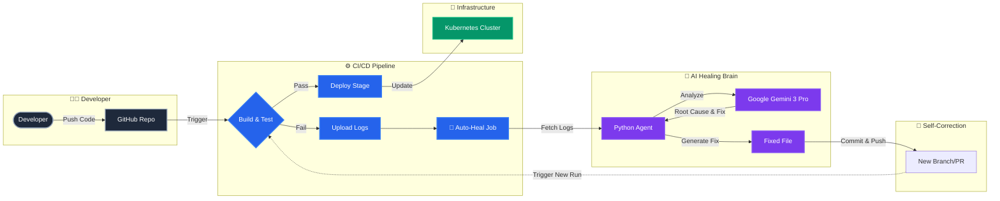

# 🏗 Architecture & Flow Diagram

This document illustrates the autonomous self-healing workflow of the platform.

## 🔄 Workflow Logic

1. **Code Push**: Developer pushes code to the repository.
2. **Standard Pipeline**: The CI runs "Build & Test".
    * ✅ **If Pass**: Continues to Deployment.
    * ❌ **If Fail**: Stops standard flow, uploads logs, and triggers the **Auto-Heal Job**.
3. **AI Analysis**: The Auto-Heal job activates the **AI Agent**, which:
    * Reads the failure logs.
    * Sends them to **Gemini 3 Pro** for deep reasoning.
    * Identifies the exact file and code causing the crash.
4. **Automatic Repair**: The Agent rewrites the broken code in the file system.
5. **Loop Closure**: The Agent pushes the fix back to the repo, automatically triggering a new pipeline run to verify the fix.
