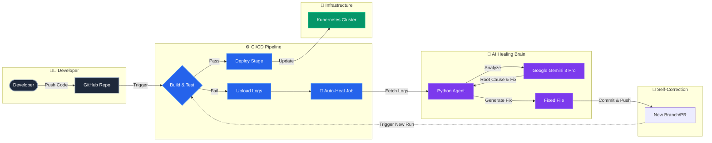

# Autonomous Self-Healing CI/CD Platform

**Enterprise-grade AIOps platform for autonomous infrastructure and code remediation.**

---

## Overview

When a pipeline fails (build error, test failure), the AI Agent:

1. **Detects** the failure  
2. **Analyzes** logs using Google Gemini  
3. **Proposes** a fix (code or config)  
4. **Implements** the fix via commit/PR  
5. **Retries** the pipeline upon approval  

---

## Architecture & Flow Diagram



---

## Tech Stack

| Layer        | Technology                          |
| ------------ | ----------------------------------- |
| **AI Agent** | Python, LangChain, Google Gemini    |
| **CI/CD**    | GitHub Actions, Jenkins, AWS, Azure, GitLab |
| **Infrastructure** | Kubernetes (Kind), Terraform, Docker |
| **Dashboard** | Next.js, TailwindCSS                |
| **Observability** | OpenTelemetry, Prometheus          |

---

## Project Structure

```
├── src/agent/        # Python AI agent (LangChain + Gemini)
├── src/dashboard/    # Next.js observability UI
├── src/target_app/   # Demo application for testing
├── infra/            # Terraform, K8s manifests, Helm
├── docs/             # Runbooks, ADRs, guides
└── .github/workflows/ # CI pipeline
```

---

## Quick Start

```bash
cp .env.example .env   # Add GOOGLE_API_KEY, GITHUB_TOKEN
cd src/agent && pip install -r requirements.txt
python main.py --provider local --dry-run
cd src/dashboard && npm install && npm run dev
```

See [docs/SETUP_RUNBOOK.md](docs/SETUP_RUNBOOK.md) and [INTEGRATIONS.md](INTEGRATIONS.md).

---

## Author

**Sergio Sediq**

- GitHub: [@SergioSediq](https://github.com/SergioSediq)
- LinkedIn: [Sergio Sediq](https://www.linkedin.com/in/sedyagho/)
- Email: sediqsergio@gmail.com
