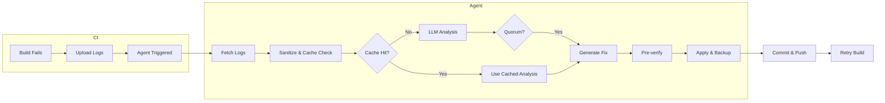
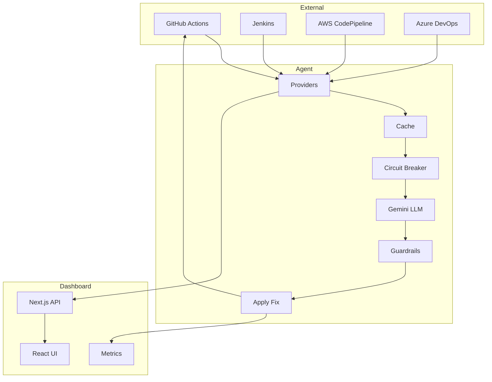
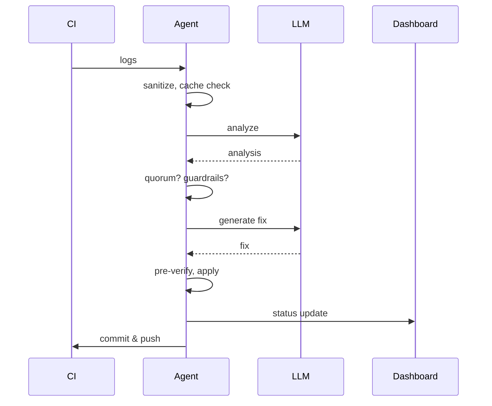

# Architecture Diagrams

## High-Level Flow

```mermaid
flowchart LR
    subgraph CI
        A[Build Fails] --> B[Upload Logs]
        B --> C[Agent Triggered]
    end
    subgraph Agent
        C --> D[Fetch Logs]
        D --> E[Sanitize & Cache Check]
        E --> F{ Cache Hit? }
        F -->|Yes| G[Use Cached Analysis]
        F -->|No| H[LLM Analysis]
        H --> I{ Quorum? }
        I -->|Yes| J[Generate Fix]
        J --> K[Pre-verify]
        K --> L[Apply & Backup]
        G --> J
    end
    L --> M[Commit & Push]
    M --> N[Retry Build]
```

## Component Diagram

```mermaid
flowchart TB
    subgraph External
        GH[GitHub Actions]
        JK[Jenkins]
        AW[AWS CodePipeline]
        AZ[Azure DevOps]
    end
    subgraph Agent
        P[Providers]
        C[Cache]
        CB[Circuit Breaker]
        LLM[Gemini LLM]
        G[Guardrails]
        A[Apply Fix]
    end
    subgraph Dashboard
        API[Next.js API]
        UI[React UI]
        M[Metrics]
    end
    GH & JK & AW & AZ --> P
    P --> C
    C --> CB
    CB --> LLM
    LLM --> G
    G --> A
    A --> GH
    P --> API
    API --> UI
    A --> M
```

## Data Flow

```mermaid
sequenceDiagram
    participant CI
    participant Agent
    participant LLM
    participant Dashboard
    CI->>Agent: logs
    Agent->>Agent: sanitize, cache check
    Agent->>LLM: analyze
    LLM-->>Agent: analysis
    Agent->>Agent: quorum? guardrails?
    Agent->>LLM: generate fix
    LLM-->>Agent: fix
    Agent->>Agent: pre-verify, apply
    Agent->>Dashboard: status update
    Agent->>CI: commit & push
```
